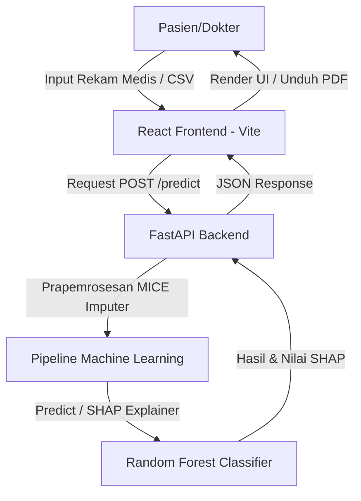

# 🩺 NephroAI: Chronic Kidney Disease (CKD) Detector


**NephroAI** adalah sebuah sistem *Clinical Decision Support* (Sistem Pendukung Keputusan Klinis) berbasis *Machine Learning* terdepan yang dirancang untuk mendeteksi dini probabilitas Penyakit Ginjal Kronis (CKD) pada pasien. Aplikasi ini memadukan keandalan algoritma Random Forest dengan antarmuka web bergaya *Clinical Minimalist & Modern Editorial*.

---

## 🌟 Fitur Utama (Advanced Edition)

- **Deteksi Prediktif Akurat:** Ditenagai oleh model *Machine Learning* Random Forest (berdasarkan `ckd_model_training.ipynb`) yang tervalidasi menggunakan dataset rekam medis klinis.
- **Sistem Multi-Bahasa (i18n):** Dukungan penuh penerjemahan antarmuka secara dinamis (**Bahasa Indonesia & Inggris**) tanpa memerlukan pemuatan ulang (*reload*) halaman.
- **Analisis Transparan (Explainable AI / SHAP):** Visualisasi grafis kontribusi parameter medis menggunakan **SHAP (SHapley Additive exPlanations)**. Membantu dokter memahami *mengapa* pasien dikategorikan berisiko tinggi (Balok Merah: meningkatkan risiko | Balok Hijau: menurunkan risiko).
- **Analisis Massal (CSV Batch Prediction):** Fitur pengunggahan dataset pasien secara massal dalam format `.csv`. Dilengkapi dengan:
  - Tombol **Unduh Template CSV** langsung di antarmuka web.
  - Ringkasan metrik global pasien (Total Pasien, Total Risiko Tinggi/Rendah).
  - Ikon **Drill-down Analisis SHAP** di setiap baris tabel untuk membedah profil risiko pasien secara individu secara instan.
- **Ekspor Laporan Klinis (PDF Report):** Fitur cetak laporan medis instan beresolusi tinggi menggunakan *Native Browser Print CSS*, lengkap dengan seluruh grafik SHAP untuk arsip klinik atau dokter.
- **Fitur "Isi Nilai Normal" (Clinical UX):** Mengisi ke-24 parameter klinis secara instan dengan baseline nilai normal sehat manusia, membantu mempercepat proses pengisian data rekam medis bagi praktisi kesehatan.
- **Pusat Edukasi Terpadu:** Edukasi patofisiologi penyakit ginjal berdasarkan pedoman klinis global (KDIGO) untuk mendukung edukasi mandiri pasien.

---

## 🏗️ Arsitektur Sistem & Deployment

Proyek ini dibangun menggunakan arsitektur *Decoupled* (Terpisah) dan sangat direkomendasikan untuk di-deploy secara terpisah (Frontend di Vercel, Backend di Render):



1. **Frontend (Web App):** React.js (Vite) + Tailwind CSS + Lucide Icons + Recharts untuk grafik. (Direkomendasikan *deploy* di **Vercel**).
2. **Backend (API Layer):** FastAPI (Python) + Uvicorn + Scikit-Learn + SHAP + Pandas. (Direkomendasikan *deploy* di **Render**).
3. **Machine Learning Pipeline:** Imputasi MICE untuk penanganan *missing values*, Robust/Standard Scaler, dan model Random Forest Classifier.

---

## 🚀 Panduan Menjalankan Secara Lokal (Local Installation)

### Prasyarat
- **Node.js** (v16 atau ke atas)
- **Python** (v3.9 atau ke atas)
- **Git**

### 1. Kloning Repositori
```bash
git clone https://github.com/ShinZeleo/NephroAI-CKD_Detector.git
cd NephroAI-CKD_Detector
```

### 2. Konfigurasi Backend (FastAPI & ML)
Buka terminal baru untuk *backend*:
```bash
# Pindah ke direktori backend
cd backend

# Buat virtual environment (disarankan)
python -m venv venv

# Aktivasi virtual environment (Windows)
venv\Scripts\activate
# Aktivasi virtual environment (Mac/Linux)
# source venv/bin/activate

# Install dependensi
pip install -r requirements.txt

# Jalankan server FastAPI
uvicorn main:app --reload --port 8000
```
Backend akan berjalan di `http://localhost:8000`.

### 3. Konfigurasi Frontend (React + Vite)
Buka terminal baru untuk *frontend*:
```bash
# Pindah ke direktori frontend
cd frontend

# Install dependensi Node modules
npm install

# Jalankan server pengembangan
npm run dev
```
Frontend akan berjalan secara lokal di `http://localhost:5173`.

---

## 🩸 Parameter Klinis yang Dianalisis

NephroAI mengonsumsi 24 paramater klinis dari rekam medis pasien:
- **Data Dasar:** Usia, Tekanan Darah, Riwayat Hipertensi, Diabetes Melitus, Penyakit Jantung Koroner, Nafsu Makan, Edema, Anemia.
- **Panel Darah:** Hemoglobin, Hematokrit (PCV), Leukosit, Eritrosit, Gula Darah Acak, Ureum (BUN), Kreatinin Serum, Natrium, Kalium.
- **Urinalisis:** Berat Jenis (Specific Gravity), Albumin (Proteinuria), Gula Urine, Sel Darah Merah (RBC), Sel Nanah (Pus Cell), Bakteri.

---

## 📜 Lisensi & Penafian Medis

Proyek ini dibuat untuk keperluan akademis dan penelitian (Tugas Pengantar Data Mining).

> **Penafian Medis (Medical Disclaimer):**
> Aplikasi *NephroAI* adalah *Proof of Concept* (PoC) berbasis kecerdasan buatan. Model ini TIDAK BOLEH digunakan sebagai substitusi absolut dari diagnosis klinis dokter. Seluruh indikasi keparahan medis wajib dirujuk dan diverifikasi langsung ke **Dokter Spesialis Penyakit Dalam Konsultan Ginjal Hipertensi (Sp.PD-KGH)** melalui pemeriksaan laboratorium fisik resmi.

---
*Didesain dan dikembangkan dengan ❤️ oleh klp7*
